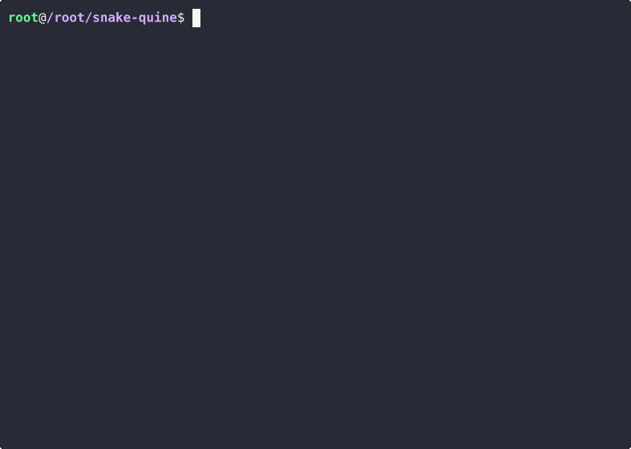

# Snake quine

This is a snake game in the terminal, but each frame of the game is valid C code.

If you compile a game frame, the executable will run the game from the moment the frame was taken.

In order to play you have to use a monospaced terminal font, and font size small enough so that the game won't overflow.

Use the arrow keys to move around, `q` to quit and `p` to pause.
